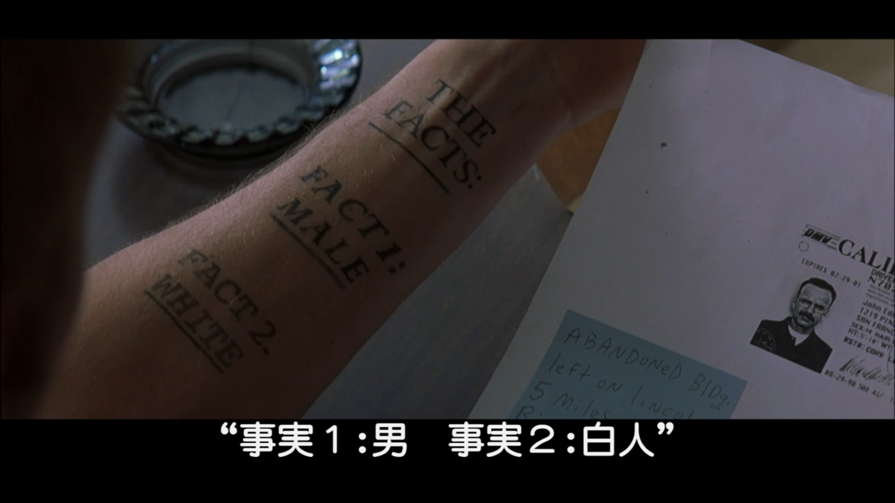
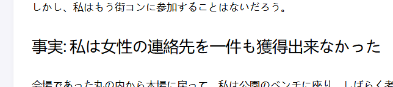

メメント観た。親がなんか映画観たいと言っていたため推挙（恥ずかしい映画しか見ていないため恥ずかしいオススメしかできない）

冒頭の主人公が自身の入れ墨を確認するシーンがGAAみたいでふふっとなった。 

 

 

『一度で理解できない映画』みたいなのに数えられててだるいし、内容的にも何度も観る映画ではないと思っていたけれど、やはり特に一回見てるからといって面白いということもないが映画としての地肩が強く新鮮にめっちゃおもしろかった。

終盤、親がよくわかってなさそうだったから説明したらわかったわからないでもなく「すごーい」と感心されてしまいかなりムカついたが、これはたぶん母親だからムカつきが勝ってるだけで、おれはこういう感じの、自分の知識や知恵をひけらかしやすく、かつそれをほめてくれるような人との会話でしか気持ちよくなれず、またそのような人としか関係性を保てないなと思い、なさけなすぎて落ち込んだ。
> *香菜、君の頭 僕がよくしてあげよう 香菜、生きることに 君がおびえぬように 香菜、明日、君を 名画座に連れていこう 香菜、カルトな映画 君に教えてあげよう* -[香菜、頭をよくしてあげよう](https://www.youtube.com/watch?v=i1_v45PGRsI&t=2s)

↑筋肉少女帯を引用するのはにゃるらのパロディですよ？